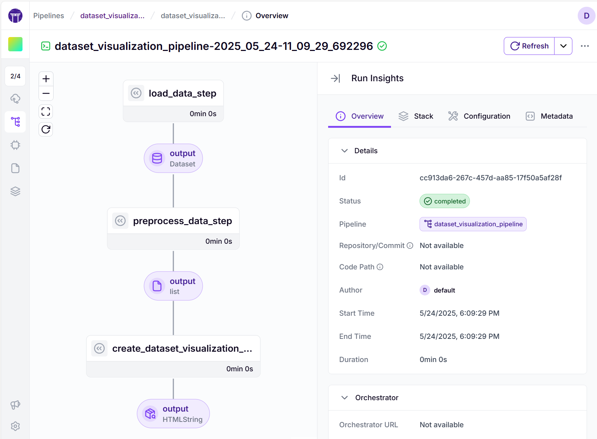
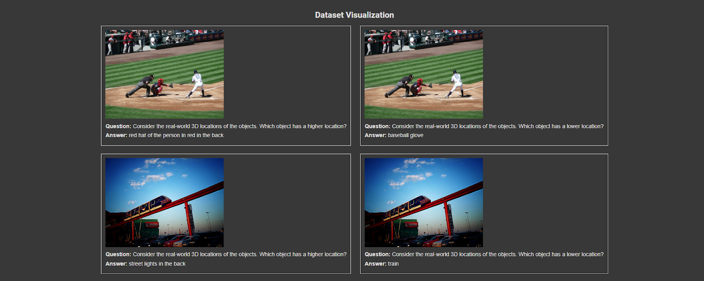
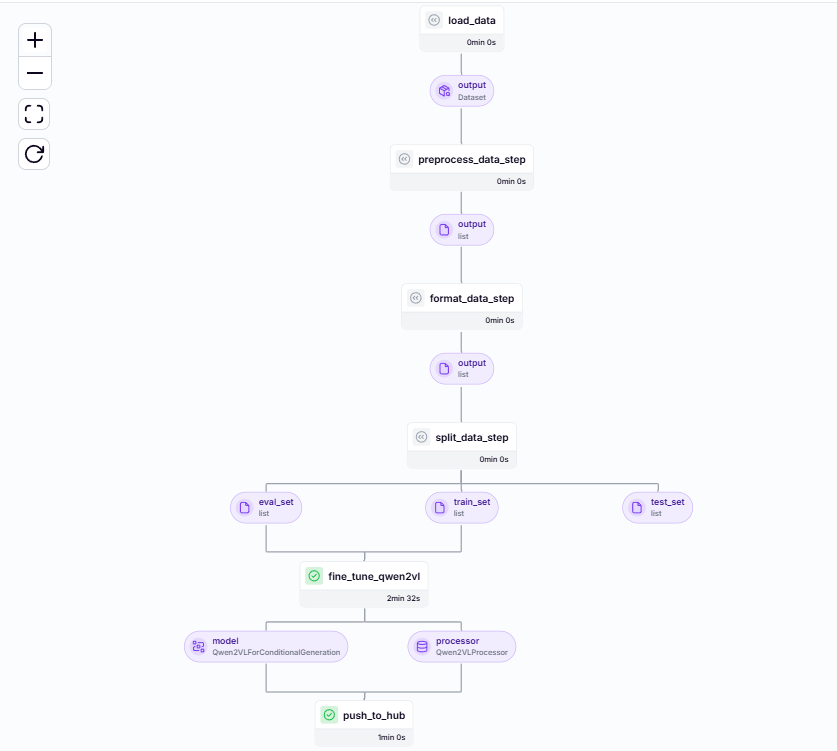
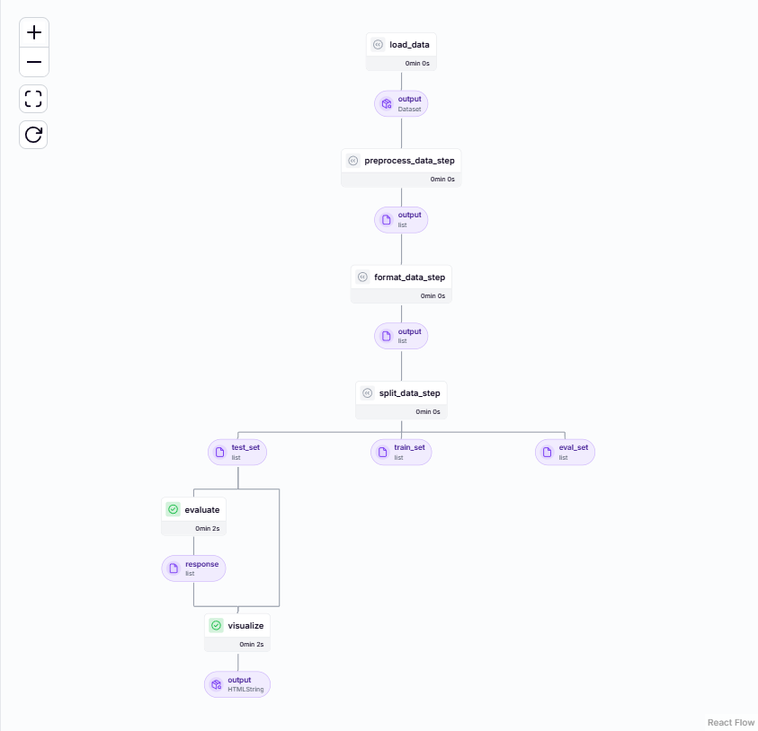
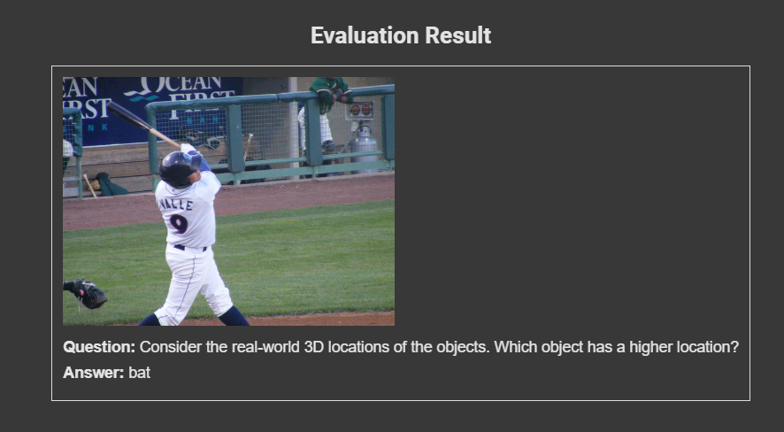
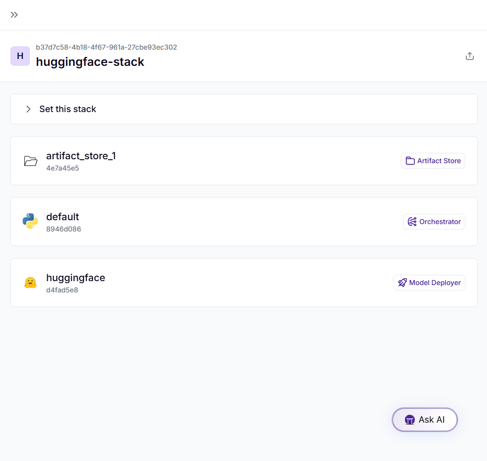

# Multimodal-LLM-Pipelines
Learn how to build, fine-tune, and deploy multimodal LLMs using ZenML

## Solution
- Setting up the development environment.
- Using 3DSRBench as the dataset.
- Preprocessing data effectively.
- Fine-tuning Qwen-VL-2b-instruct, a vision-language model.
- Performing inference to evaluate results.
- Writing a Pipeline that deploys the model.

## Installation
```bash
!pip install zenml
!pip install torch torchvision
!pip install transformers
!pip install pillow
!pip install datasets
!pip install accelerate
!pip install trl
!pip install qwen_vl_utils
!pip install "zenml[server]"
```
or
```bash
pip install -r requirements.txt
```

## ZenML Server
The server is a centralized endpoint for managing pipelines, models, metadata, and secrets. Key features include:
```bash
!zenml init
!zenml login
```

or you can use local ZenML deployment with
```bash
!zenml login --local
```

## Dataset
Used [`3DSRBench dataset`](https://huggingface.co/datasets/ccvl/3DSRBench) for spatial reasoning tasks.
```
from datasets import load_dataset
@step
def load_data():
    return load_dataset("ccvl/3DSRBench")["test"] # The dataset has only test set.
```
the data looks like:
```
{
     'index': 'VIN6MS3J',
     'question': 'Consider the real-world 3D locations of the objects. Which object has a higher location?',
     'A': 'baseball glove',
     'B': 'red hat of the person in red in the back',
     'C': None,
     'D': None,
     'answer': 'B',
     'category': 'height_higher',
     'image_source': 'MS-COCO',
     'image_url': 'http://images.cocodataset.org/train2017/000000557944.jpg'
 }
```

## Steps
- load_data_step.py
- formate_data_step.py
- preprocess_data_step.py
- split_data_step.py
- evaluate_step.py
- create_dataset_visualization_step.py
- visualize_step.py

## Pipelines
- Dataset-Visualization Pipeline





- Fine-Tuning Pipeline


- Evaluate Pipeline


Output Evaluate result:


- Deployment Pipeline
- 

## Deployment
```bash
!zenml stack register huggingface-stack -o default -a artifact_store
!zenml model-deployer register huggingface-deployer --flavor=huggingface --token=<token> --namespace=<namespace>
!zenml stack update huggingface-stack -d huggingface-deployer
!zenml stack set huggingface-stack
```

To make sure everything is set up properly, here’s what we can do:
```bash
!zenml stack describe
```

Finally, execute the deployment pipeline:
```
huggingface_deployment_pipeline(<huggingface repository>, <model name>, <namespace>)
```

## Acknowledgments
 - [Zenml](https://www.zenml.io/)
 - [Multimodal LLM Pipelines From Data Ingestion to Real-Time Inference by Haziqa Sajid](https://www.zenml.io/blog/multimodal-llm-pipelines-from-data-ingestion-to-real-time-inference)
 - [Dataset by Hugging Face.](https://huggingface.co/)
 - [Qwen/Qwen2-VL-2B-Instruct](https://huggingface.co/Qwen/Qwen2-VL-2B-Instruct)


